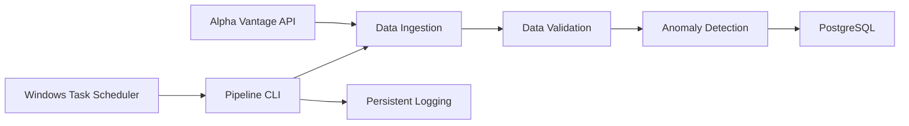

# QuantPipe

QuantPipe is a fault-tolerant market data pipeline built in Python that collects daily stock-market data, validates its quality, detects unusual price and volume movements, and stores processed observations in PostgreSQL.

The project focuses on data reliability and operational resilience. It includes automated validation, anomaly detection, idempotent database writes, retry handling for temporary network failures, transaction rollback, persistent logging, automated testing, and scheduled execution.

## Pipeline Architecture



The pipeline can be executed manually through its command-line interface or automatically using Windows Task Scheduler.

## Key Features

* Retrieves daily OHLCV market data from Alpha Vantage
* Standardizes API responses into Pandas DataFrames
* Validates missing values, duplicate dates, positive prices, volume, and OHLC relationships
* Detects unusual daily price movements and trading volume
* Stores processed observations in PostgreSQL
* Prevents duplicate records using a composite `(symbol, date)` primary key
* Retries temporary HTTP and network failures
* Rolls back failed database transactions
* Records successful and failed pipeline executions using persistent logging
* Supports different stock symbols through a command-line interface
* Supports automated execution using Windows Task Scheduler
* Includes an automated pytest test suite

## Project Structure

```text
Quantpipe/
├── src/
│   ├── __init__.py
│   ├── ingestion.py
│   ├── validation.py
│   ├── anomaly_detection.py
│   ├── database.py
│   ├── logger.py
│   └── pipeline.py
├── tests/
│   ├── test_ingestion.py
│   ├── test_validation.py
│   ├── test_anomaly_detection.py
│   ├── test_database.py
│   └── test_pipeline.py
├── run_quantpipe.bat
├── requirements.txt
├── .env.example
├── .gitignore
└── README.md
```

### Module Responsibilities

* `ingestion.py` — retrieves market data from Alpha Vantage and converts it into a standardized Pandas DataFrame.
* `validation.py` — checks market data for missing values, duplicate dates, invalid prices, invalid volume, and inconsistent OHLC relationships.
* `anomaly_detection.py` — identifies unusual daily price movements and trading volume.
* `database.py` — manages PostgreSQL connections, table creation, transactions, and data insertion.
* `logger.py` — configures console and persistent file logging.
* `pipeline.py` — orchestrates the complete QuantPipe workflow.

## Installation

### 1. Clone the Repository

```bash
git clone https://github.com/Developere19/Quantpipe.git
cd Quantpipe
```

### 2. Create a Virtual Environment

QuantPipe was developed using Python 3.12.

On Windows:

```powershell
py -3.12 -m venv .venv
```

Activate the environment:

```powershell
.\.venv\Scripts\Activate.ps1
```

### 3. Install Dependencies

```powershell
pip install -r requirements.txt
```

## Configuration

Create a `.env` file in the project root using `.env.example` as a template.

```text
ALPHA_VANTAGE_API_KEY=your_api_key_here

DB_HOST=localhost
DB_PORT=5432
DB_NAME=quantpipe
DB_USER=your_database_user
DB_PASSWORD=your_database_password
```

The `.env` file is excluded from version control so API keys and database credentials are not stored in the repository.

## PostgreSQL Setup

QuantPipe requires a PostgreSQL database named `quantpipe`.

For example, from PostgreSQL:

```sql
CREATE DATABASE quantpipe;
```

The pipeline automatically creates the required `market_data` table if it does not already exist.

Each market observation is uniquely identified by its stock symbol and trading date. The database uses `(symbol, date)` as its primary key.

Repeated pipeline executions therefore do not create duplicate observations.

## Running QuantPipe

Run the pipeline from the project root and provide the stock symbol as a command-line argument.

For Apple:

```powershell
python -m src.pipeline AAPL
```

For IBM:

```powershell
python -m src.pipeline IBM
```

The symbol is supplied through the command-line interface, allowing different stocks to be processed without modifying the source code.

A successful execution produces log output similar to:

```text
INFO | Starting pipeline for AAPL
INFO | Pipeline completed successfully for AAPL
```

Logs are also persisted to:

```text
logs/quantpipe.log
```

## Data Validation

Before observations are stored, QuantPipe checks the incoming market data for:

* Missing values
* Duplicate trading dates
* Non-positive OHLC prices
* Negative trading volume
* Invalid OHLC relationships

Invalid data causes the pipeline to fail rather than silently storing potentially corrupted observations.

## Anomaly Detection

QuantPipe performs two simple anomaly checks on validated market data.

### Price Anomalies

Daily percentage returns are calculated from closing prices. An observation is flagged when the absolute daily return exceeds the configured threshold.

The default threshold is 10%.

### Volume Anomalies

Trading volume is compared with the average volume in the retrieved dataset.

An observation is flagged when its volume exceeds the configured multiple of average volume. The default multiplier is `2.0`.

These rules are intentionally configurable so the anomaly-detection logic can be extended without changing the overall pipeline architecture.

## Reliability Design

QuantPipe includes several mechanisms designed to make pipeline execution more reliable:

* **Retry handling** — temporary HTTP and network failures are retried automatically.
* **Data validation** — invalid observations are rejected before database insertion.
* **Idempotent loading** — the `(symbol, date)` primary key prevents duplicate observations when the pipeline is rerun.
* **Transaction rollback** — failed database operations are rolled back to avoid partial writes.
* **Failure propagation** — pipeline failures are logged and re-raised so an external scheduler can detect an unsuccessful execution.
* **Persistent logging** — successful and failed executions are recorded for troubleshooting.
* **Automated testing** — tests cover normal operation as well as network, validation, database, and orchestration failure scenarios.

## Automated Testing

Run the complete test suite with:

```powershell
python -m pytest -v
```

The current test suite contains 23 automated tests covering:

* Market data ingestion
* API response handling
* Network failures and retry recovery
* Data validation
* Price anomaly detection
* Volume anomaly detection
* PostgreSQL insertion
* Transaction commit and rollback behaviour
* Pipeline failure propagation
* End-to-end pipeline orchestration using mocked components

External dependencies are mocked where appropriate so the unit tests do not depend on live API or database responses.

## Automated Scheduling

The repository includes `run_quantpipe.bat` for automated execution on Windows.

The launcher runs the pipeline using the Python interpreter inside the project's virtual environment:

```bat
@echo off

cd /d "%~dp0"

.venv\Scripts\python.exe -m src.pipeline AAPL
```

`%~dp0` resolves to the directory containing the batch file, avoiding a hard-coded user-specific project path.

The launcher can be configured as a **Windows Task Scheduler** action to execute QuantPipe automatically on a chosen schedule.

## Technology Stack

* Python 3.12
* Pandas
* Requests
* PostgreSQL
* psycopg2
* python-dotenv
* pytest
* Alpha Vantage API
* Windows Task Scheduler
* Git / GitHub

## Future Improvements

Possible extensions include:

* Rolling historical baselines for anomaly detection
* Batch PostgreSQL inserts for larger datasets
* Processing multiple symbols in a single scheduled execution
* Linux-based deployment
* Apache Airflow orchestration
* Docker containerisation
* Continuous integration using GitHub Actions
* Additional monitoring and pipeline health metrics

## What This Project Demonstrates

QuantPipe demonstrates practical data-engineering and data-operations concepts including API ingestion, data-quality validation, anomaly detection, relational database storage, transaction management, idempotency, retry logic, logging, automated testing, command-line interfaces, and scheduled pipeline execution.
